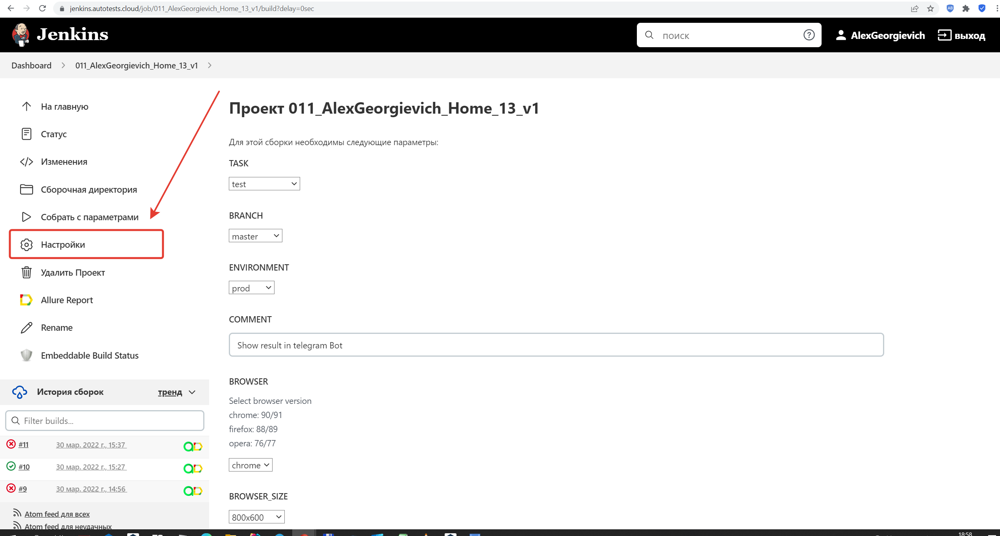
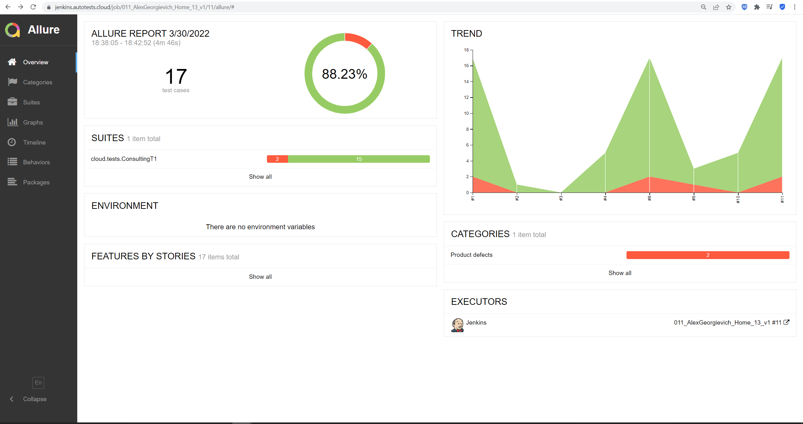

## Проект по тестированию сайта компании "Т1 Консалтинг"
#### российский разработчик и интегратор, входит в Группу Т1
> <a target="_blank" href="https://www.t1-consulting.ru/">Ссылка на главную страницу сайта</a>


### :drop_of_blood: Содержание:

- [Технологии и инструменты](#earth_africa-технологии-и-инструменты)
- [Реализованные проверки](#earth_africa-Реализованные-проверки)
- [Сборка в Jenkins](#earth_africa-Jenkins-job)
- [Запуск из терминала](#earth_africa-Запуск-тестов-из-терминала)
- [Allure отчет](#earth_africa-Allure-отчет)
- [Отчет в Telegram](#earth_africa-Уведомление-в-Telegram-при-помощи-бота)
- [Видео примеры прохождения тестов](#earth_africa-Примеры-видео-о-прохождении-тестов)


### Проект реализован с использованием
Java Gradle IntelliJ IDEA Selenide Selenoid JUnit5 Jenkins Allure Report Allure TestOps Telegram Jira
<p align="center">


</p>

### Список проверок, реализованных в автотестах
- [x] Наличие  заголовка и меню на главной странице
- [x] Наличие заданных пунктов подменю в разделе "О компании" и проверка "девиза" компании
- [x] Проверка главного меню сайта с переменными названиями разделов меню, их наполнение страниц разделов
- [x] Наличие раздела "О компании" и достоверности раздела меню 
- [x] Проверка  меню и наполнение разделов меню "О компании"
  -    проверки проводятся с использованием Параметризованных тестов
- [x] Проверка наличия и доступности к скачиванию инструкции по эксплуатации системы "T1 Watchman", формат PDF
  - проверка содержимого инструкции
- [x] Проверка на наличие ошибок в console log


### Сборка в Jenkins
##  Запуск тестов в [Jenkins](https://jenkins.autotests.cloud/job/011_AlexGeorgievich_Home_13_v1/)
*Для запуска сборки необходимо указать значения параметров и нажать кнопку <code><strong>*Собрать*</strong></code>.*

<p align="center">
  
</p>

<p align="center">
  
</p>

### Удаленный запуск тестов

```bash
gradle clean test 
-Dbrowser=${BROWSER}
-DbrowserVersion=${BROWSER_VERSION}
-DbrowserSize=${BROWSER_SIZE}
-DremoteDriverUrl=https://${USER}:${PASSWORD}@${REMOTE_DRIVER_URL}/wd/hub/
-DvideoStorage=https://${REMOTE_DRIVER_URL}/video/
-Dthreads=${THREADS}
```
### Параметры сборки

> <code>BROWSER</code> – браузер, в котором будут выполняться тесты (_по умолчанию - <code>chrome</code>_).
>
> <code>BROWSER_VERSION</code> – версия браузера, в которой будут выполняться тесты (_по умолчанию - <code>91.0</code>_).
>
> <code>BROWSER_SIZE</code> – разрешени окна браузера, в котором будут выполняться тесты (_по умолчанию - <code>1920x1080</code>_).
>
> <code>REMOTE_URL</code> – адрес удаленного сервера, на котором будут запускаться тесты.
>
> <code>USER</code> - логин пользователя для подключения к Selenoid
>
> <code>PASSWORD</code> - пароль пользователя для подключения к Selenoid
>
> <code>THREADS</code> - количество одновременных запускаемых потоков для тестов.
>
 
### Запуск из терминала
```bash
gradle clean test
```
### Allure отчет

<p align="center">
  
</p>

### Отчет в Telegram

### Видео примеры прохождения тестов
 
Serve report:
```bash
allure serve build/allure-results
```
 
:heart: <a target="_blank" href="https://qa.guru">qa.guru</a><br/>
:blue_heart: <a target="_blank" href="https://t.me/qa_automation">t.me/qa_automation</a>
